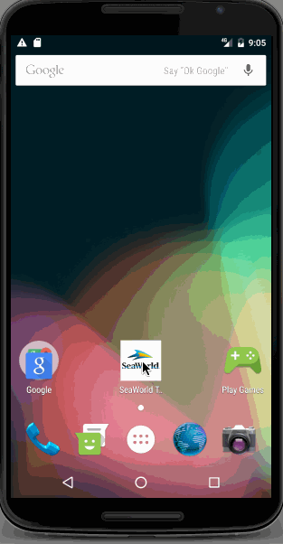

# Pre-work - *SeaWorld Todo List*

**SeaWorld Todo List** is an android app that allows building a todo list and basic todo items management functionality including adding new items, editing and deleting an existing item.

Submitted by: **Babu SR**

Time spent: **6** hours spent in total

## User Stories

The following **required** functionality is completed:

* [ ] User can **successfully add and remove items** from the todo list
* [ ] User can **tap a todo item in the list and bring up an edit screen for the todo item** and then have any changes to the text reflected in the todo list.
* [ ] User can **persist todo items** and retrieve them properly on app restart

The following **optional** features are implemented:
* [ ] Persist the todo items into SQLite instead of a text file using DBFlow
* [ ] Improve style of the todo items in the list [using a custom adapter](http://guides.codepath.com/android/Using-an-ArrayAdapter-with-ListView)
* [ ] Tweak the style improving the UI / UX, play with colors, images or backgrounds

# SeaWorld Todo List
.

